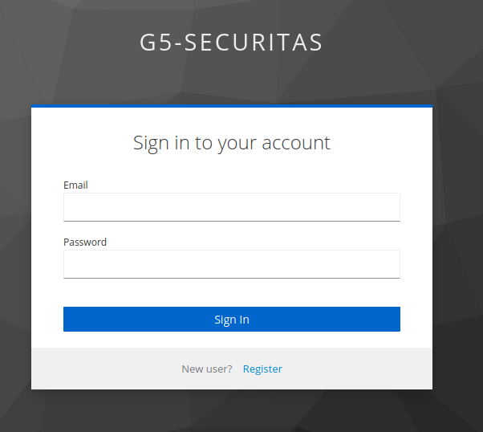

# Identity Provider

The [Keycloak](https://www.keycloak.org/) was the tool chosen to develop the Identity Provider.

## Keycloak Configuration

The first step was to create a realm for our project, "g5-securitas".

Next, we created 2 roles for the realm in question, one for management users and another for client users, respectively "g5-admin" and "g5-end-users". The default role "default-roles-g5-securitas" is also a role that identifies users as clients.

The management users are configured by the keycloak admin server, where credentials and the "g5-admin" role are assigned, in order to be able to authenticate in the Management UI.

Finally, we created 3 clients, one for the Managment Web UI, another for the Client Web UI and for the Sites Managment API.

## Frontend integration with IDP
In order to integrate the IDP in the frontends we had to install the following dependencies:
```
npm i keycloak-js
npm i @react-keycloak/web
```
We create a Keycloak.js file, where we create a Keycloak instance with the Keycloak server URL, with the realm name and the respective frontend ID.
```javascript
import Keycloak from "keycloak-js";
const keycloak = new Keycloak({
 url: process.env.REACT_APP_KEYCLOAK_URL,
 realm: process.env.REACT_APP_REALM,
 clientId: process.env.REACT_APP_CLIENT_UI_ID,
});

export default keycloak; 
```

In the index.js file, we import the < ReactKeycloakProvider /> with the keycloak.js file as a prop. Wraps the entire app with the identity provider
```javascript
import React from 'react';
import ReactDOM from 'react-dom/client';
import './index.css';
import App from './App';
import reportWebVitals from './reportWebVitals';
import { ReactKeycloakProvider } from "@react-keycloak/web";
import keycloak from "./Keycloak";

const root = ReactDOM.createRoot(document.getElementById('root'));
root.render(
   <ReactKeycloakProvider authClient={keycloak}>
    <App />
   </ReactKeycloakProvider>
);

reportWebVitals();
```

In both frontends, in the Sidebar we define that the Home page is a public page and the rest are private pages, that is, the Home page can be accessed without authentication, but the rest can only be accessed with authentication.

We implemented code in the frontends that checks if there is an authenticated user, if there is it shows a Logout button and the name of the authenticated user, if not it shows the Login button. When the Login button is clicked, Keycloak's Login method is executed to authenticate the user. When the Logout button is clicked, Keycloak's Logout method is executed to Logout of the user's account.


In the frontends, in each call to the Sites Management API we add the 'Authorization' header with the authenticated user token.

## Sites Managment API integration with IDP